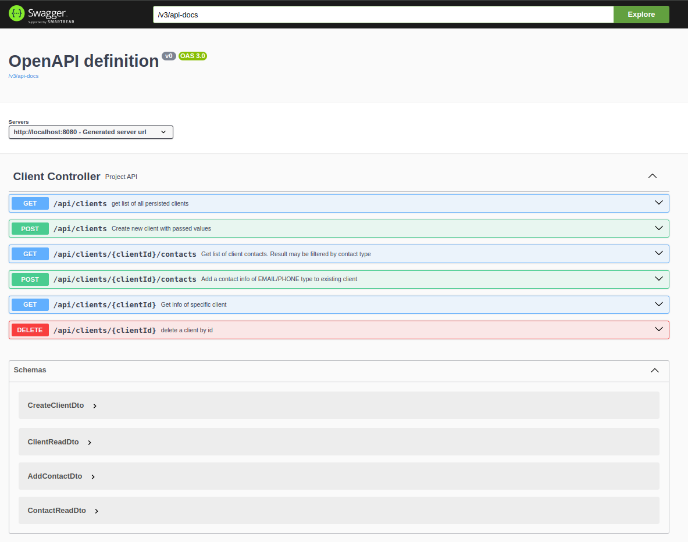
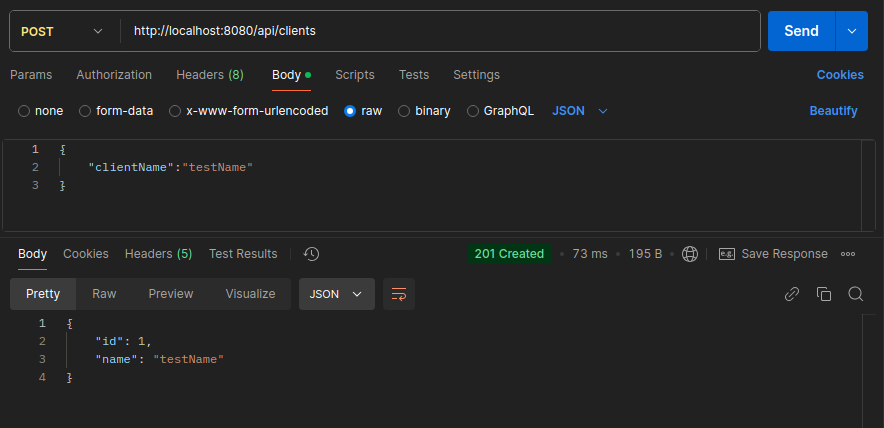
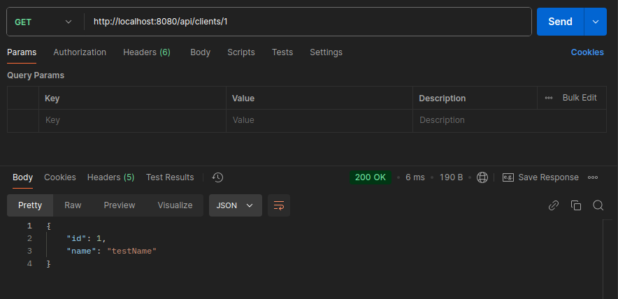
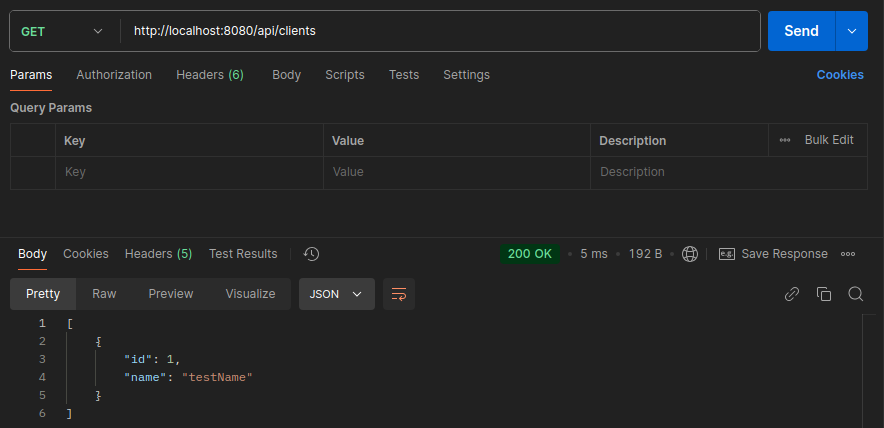
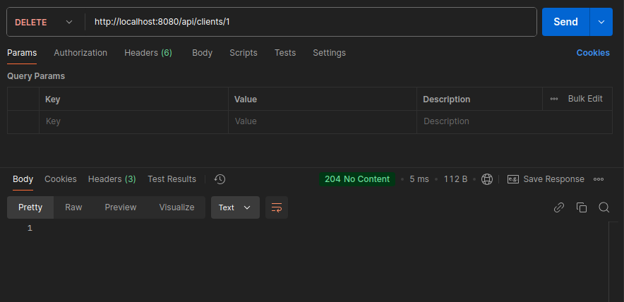
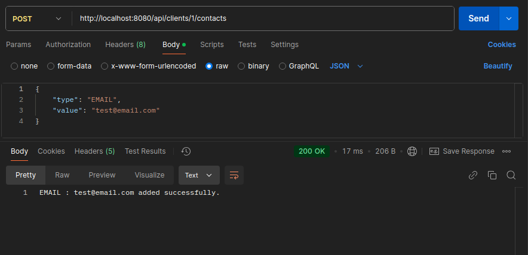
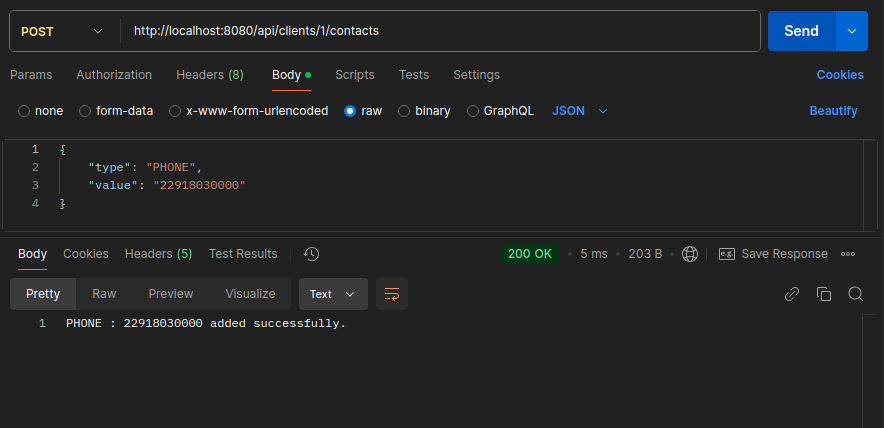
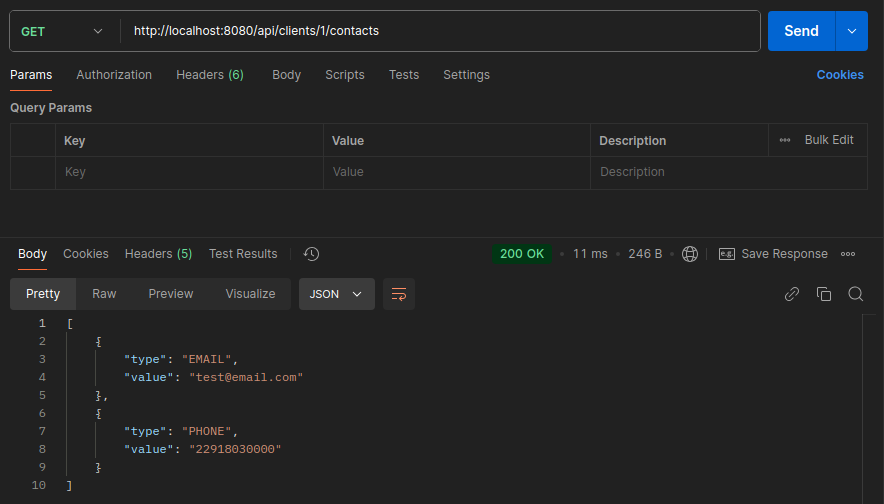
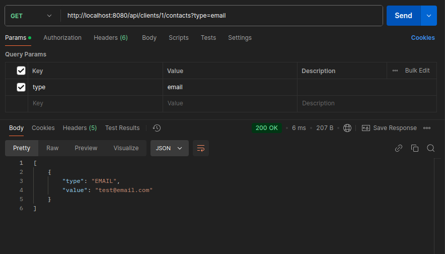
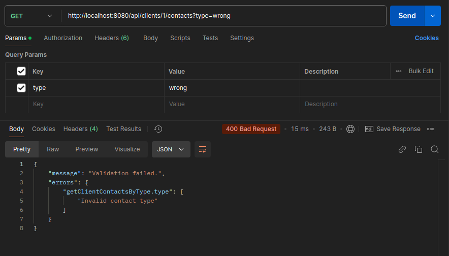

# Client Service

### Описание:

Спроектировать простую БД, обеспечивающую хранение информации о клиентах и их контактной информации.
Каждый клиент характеризуется именем.
Каждому клиенту в соответствие может быть поставлена информация о его контактах: 0 и более телефонных номеров, 
0 и более адресов электронной почты.
Разработать в Spring Framework API, обеспечивающее работу с данной БД.
API должно обеспечивать следующие функции:

1) Добавление нового клиента
2) Добавление нового контакта клиента (телефон или email)
3) Получение списка клиентов
4) Получение информации по заданному клиенту (по id)
5) Получение списка контактов заданного клиента
6) Получение списка контактов заданного типа заданного клиента

## Технологии:
1) Java 21
2) Spring Boot 3.4.2
3) Lombok 1.18.36
4) Maven 3.9.9
5) OpenApi 2.5.0

## Инструкция по установке:

1. **Клонируйте репозиторий**:
   ```bash
   git clone https://github.com/lenarsharipov/client_service_unibell.git
   cd client_service_unibell

2. **Соберите и запустите приложение с использованием Docker**.
   Это соберет и запустит приложение.
   ```bash
   docker-compose up --build

## АПИ:
Приложение настроено на работу на localhost:8080.
Описание АПИ доступно по: http://localhost:8080/swagger-ui/index.html#/


Для запросов к endpoints через Postman



















